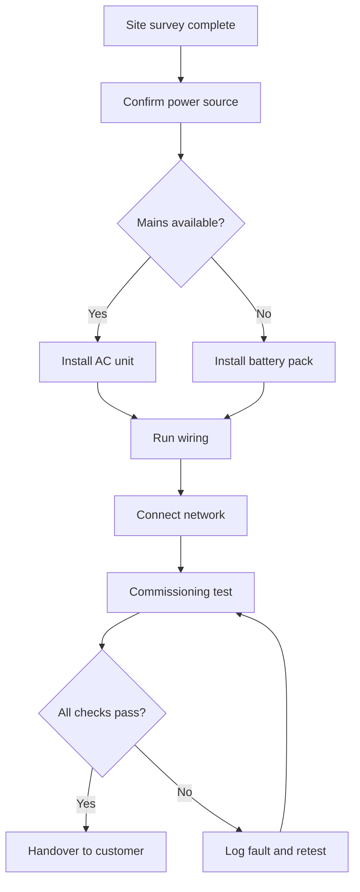
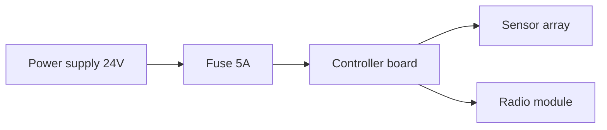
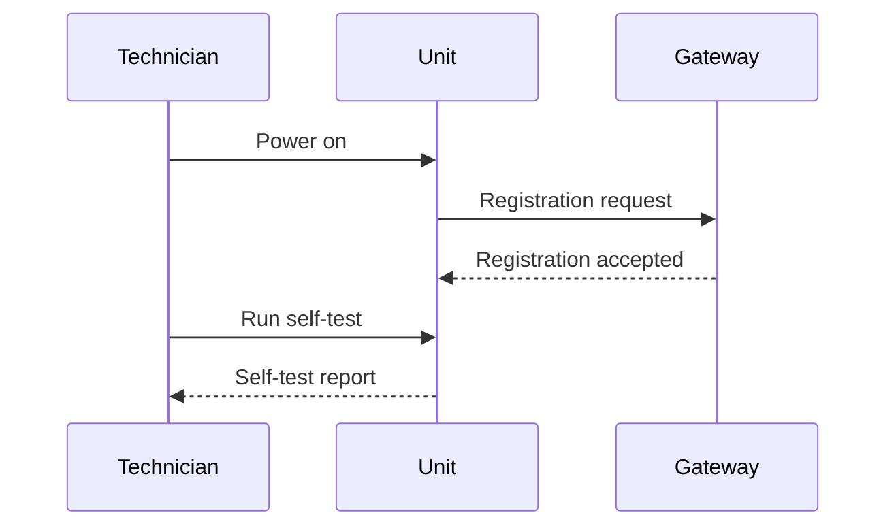

# Deployment Guide

This guide describes the standard deployment of a field unit, from arriving on site to customer handover.

## 1. Overview

The deployment follows a fixed sequence. Do not skip steps — the commissioning test assumes every earlier step is complete.

## 2. Site preparation

Before any hardware is unpacked:

- Confirm the site survey report is signed and dated
- Check that the mounting surface is clear and dry
- Verify that the cable route matches the survey drawing
- Confirm the customer contact is on site or reachable

## 3. Power

Every unit is fed through a fused supply. Never connect a unit directly to an unfused source.

Exact ratings per unit type are listed in [power-specs.md](power-specs.md).

## 4. Wiring

Route the sensor cable away from the power cable wherever possible. Where they must cross, cross at ninety degrees.

Torque values:

| Terminal | Torque |
|---|---|
| Power input | 0.6 Nm |
| Sensor terminals | 0.4 Nm |
| Earth stud | 1.2 Nm |

## 5. Network

The unit registers itself with the gateway on power-up. No manual addressing is required.

If registration does not complete within two minutes, check the radio module seating before replacing anything.

## 6. Commissioning

Run the self-test from the front panel. A passing unit shows a steady green indicator. Any other pattern means the test failed — log the fault code and retest after correcting it.

## 7. Handover

Give the customer the signed commissioning report and walk them through the front panel indicators before leaving site.
